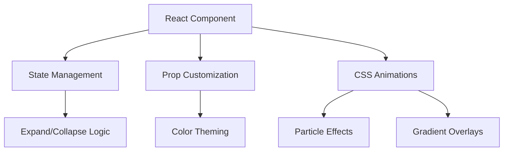

<h1 align="center">
  <br>
  
  <br>
  Cosmic Text Expander 🌌
  <br>
</h1>

<h4 align="center">A Stellar React Component for Elegant Content Expansion</h4>

<div align="center">
  
[](https://reactjs.org/)
[](https://opensource.org/licenses/MIT)
[](https://ihsansaif313.github.io/Text-Expander-React/)

</div>

<div align="center">
  
</div>

## ✨ Features

<div align="center">
  
| **Dynamic Content**          | **Customization**             | **Visual Effects**           |
|------------------------------|-------------------------------|------------------------------|
| 🌟 Intelligent text truncation | 🎨 Themeable color schemes    | 🌠 Animated particle effects |
| 📖 Smooth expansion transitions | 🔧 Configurable word count    | 💫 Gradient overlays          |
| 🌐 Responsive design           | 🖋 Custom button labels       | ✨ Interactive hover states   |

</div>

## 🚀 Quick Start

### Prerequisites
- Node.js ≥16.x
- npm ≥8.x

### Installation
```bash
git clone https://github.com/ihsansaif313/Text-Expander-React.git
cd Text-Expander-React
npm install
npm start
```
#🪐 Component Usage
```bash
<TextExpander
  collapsedNumWords={15}
  expandButtonText="Reveal Cosmic Secrets"
  buttonColor="#7C3AED"
  className="nebula-effect"
>
  {spaceContent}
</TextExpander>
```
# 🌠 Customization Options

<div align="center">

| Property             | Description                          | Default      | Example Values         |
|----------------------|--------------------------------------|--------------|------------------------|
| `collapsedNumWords`  | Initial visible word count           | `5`          | `10`, `20`, `30`       |
| `buttonColor`        | Gradient button color                | `#16a34a`    | `#7C3AED`, `#DB2777`   |
| `expandButtonText`   | Expansion trigger text               | `Show more`  | `Expand`, `Read more`  |
| `className`          | Additional CSS classes               | `""`         | `custom-style`         |

</div>


## 🌌 Technical Architecture


## License 📄

Distributed under the MIT License. See `LICENSE` for more information.

---

👨💻 **Created by IHSAN SAIF**  
📧 **Contact:** [ihsansaifedwardion@gmail.com]  
[]([https://github.com/ihsansaif313](https://github.com/ihsansaif313))
[]([https://linkedin.com/in/ihsansaif313](https://www.linkedin.com/in/its-saif-products )
